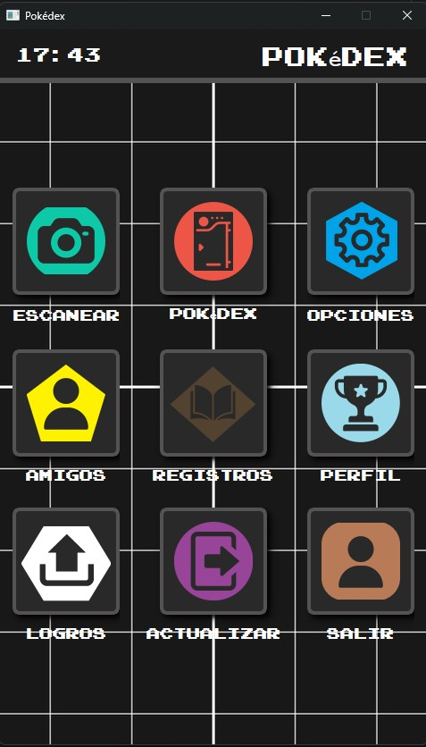
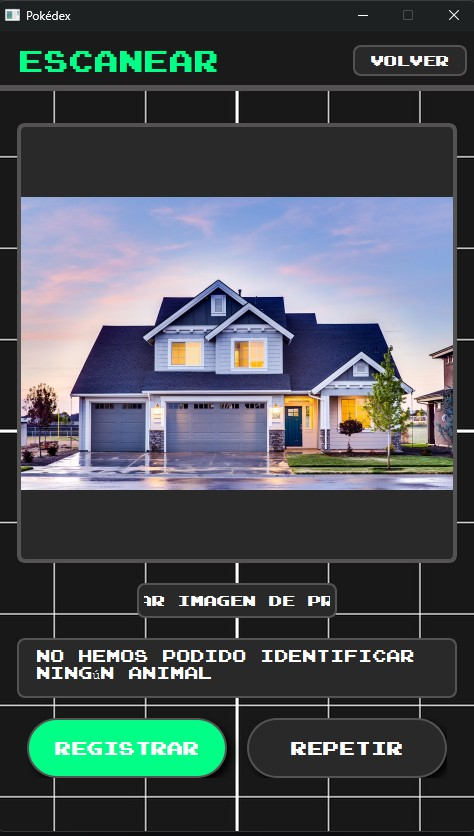
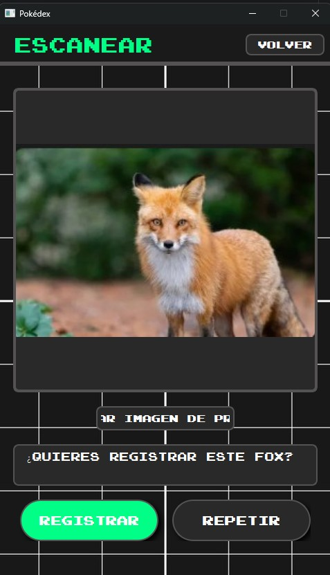
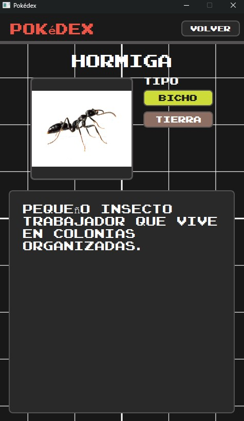
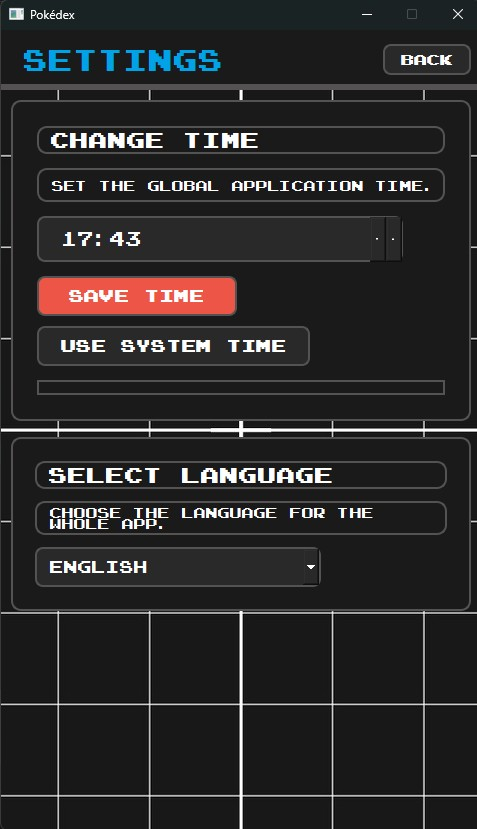

# Animal Image Classifier 

##  Project Description

Animal Image Classifier is a desktop application that uses deep learning to identify animal species from images.

The application features a graphical user interface built with PySide6 and a Convolutional Neural Network (CNN) trained on more than 60,000 images across 60 different animal classes. Users can classify animals and register them in a personal collection inspired by the concept of a Pokédex.

---

##  Technologies Used

- **Python** – Core application logic
- **TensorFlow** – Deep learning model training and inference
- **PySide6** – Desktop graphical user interface
- **NumPy** – Numerical operations and data processing
- **Pillow** – Image loading and preprocessing

---

##  Main Features

- Desktop GUI built with PySide6
- Animal recognition from images
- Classification across 60 animal species
- Confidence score for predictions
- Personal collection tracking
- Image preprocessing pipeline

---

##  Machine Learning Pipeline

1. Image collection and preprocessing
2. Data augmentation
3. CNN model training
4. Model evaluation
5. Real-time image classification
6. Animal registration and storage

---

##  Dataset

* More than 60,000 images
* 60 animal categories
* Image normalization and preprocessing
* Training, validation, and testing splits

---


##  Screenshots

### Main Interface



### Animal Prediction




### Collection System




### Settings



---

##  Installation

Clone the repository:

```bash
git clone https://github.com/germanmm04/animal-image-classifier.git
```

Install dependencies:

```bash
pip install -r requirements.txt
```

Run the application:

```bash
python main.py
```

---

##  What I Learned

* Deep learning fundamentals
* Convolutional Neural Networks (CNNs)
* Image preprocessing techniques
* Dataset preparation and augmentation
* Model evaluation and optimization
* Computer vision workflows
* Integration of AI models into desktop applications

---

##  Future Improvements

* Increase the number of supported animal species
* Implement transfer learning with pretrained models
* Add mobile application support
* Real-time camera classification
* Cloud synchronization for user collections
* Improve model accuracy and inference speed

---

##  Author

Personal project developed as part of my portfolio in Artificial Intelligence, Big Data, and Software Development.
